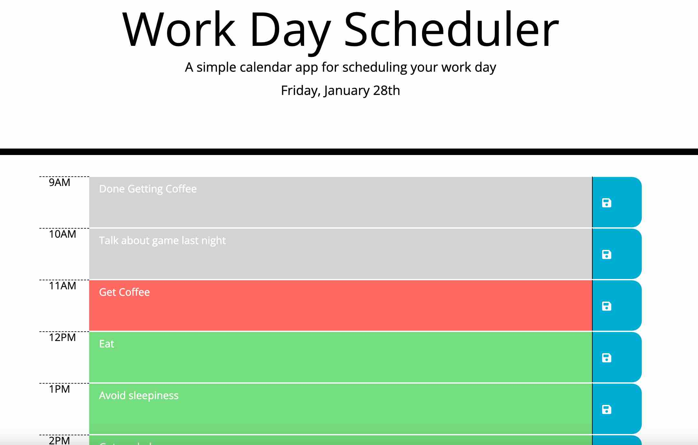

# work-day-scheduler

## Purpose
This is a scheduler that runs in a browser window.  With this app, the user can plan the current day's work.  The user is able to update the planned task by hour of the day.  The scheduler provides visual indicators by color as the day progresses.  Tasks that are in the past are greyed out where current tasks are presented in red and planned future tasks are presented in green.  When the user click on the save icon, the work plan is saved to local storage so that if the browser window is closed, the tasks persist.

## Built With
* JavaScript
* CSS
* HTML

## Website
https://bdswartz.github.io/work-day-scheduler/

## Contribution

## Screen Shots

The following screen shot is of the landing screen, where the instructions for game play are given and the user is allowed to start the quiz when ready.

